# Huwelijksplanner
In de volgende stappen worden de benodigde API calls per stap doorgelicht

## Schermen
- [Scherm 0: Introductie](#scherm-0-introductie)
- [Scherm 1: Huwelijk of geregistreerd partnerschap?](#scherm-1-huwelijk-of-geregistreerd-partnerschap)
- [Scherm 2: datum kiezen](#scherm-2-datum-kiezen)
- [Scherm 3: overzicht keuze, door naar DigiD ](#scherm-3-overzicht-keuze-door-naar-digid)
- [Scherm: inloggen bij DigiD](#scherm-inloggen-bij-digid)
- [Scherm 4: contactgegevens invullen en gegevens controleren](#scherm-4-contactgegevens-invullen-en-gegevens-controleren)
- [Scherm 5: partner uitnodigen](#scherm-5-partner-uitnodigen)
- [Scherm: getuigen aanmelden](#scherm-getuigen-aanmelden)
- [Scherm: controles uitgevoerd](#scherm-controles-uitgevoerd)
- [Scherm: wachten op partner](#scherm-wachten-op-partner)
- [Scherm: betaling gelukt](#scherm-betaling-gelukt)
- [Scherm: getuigen aanpassen](#scherm-getuigen-aanpassen)
- [Scherm: extra bestellen](#scherm-extra-bestellen)
- [Scherm: annuleer reservering](#scherm-annuleer-reservering)
- [Scherm: bevestiging annulering](#scherm-bevestiging-annulering)

### Scherm 0: Introductie

[Bekijk prototype ](https://huwelijk.utrecht.eend.nl/docs/site/huwelijksplanner/index.html)


**Introductie**:
- verwachtingen
  - type trouwen dat kan
  - datum kiezen
  - locatie kiezen
- wat heb je nodig?
  - DigiD van jou en partner (een van beide geen DigiD? Ga naar de balie)
  - iDEAL (tenzij gratis)
  - gegevens van getuigen
  - 
**De voorwaarden worden niet expliciet vooraf medegedeeld**:
- partners zijn beiden 18 jaar (op trouwdatum)
- niet al getrouwd
- verklaring tweedegraads bloedverwantschap

**Opmerking**:
- kun je ook een ambtenaar kiezen?

> De backend gaat uit van één huwelijks object wat gedurende de klantreis word aangepast en gevalideerd. Dat leid ertoe dat veel van de genoemde POST calls uit dit stuk voor de backend eignelijk PUT operaties zijn op een loppend huwelijk

```json  
POST {environment}/api/huwelijken

{
}

RESPONSE

{
  ... het volledige huwelijks object.
}
```

**Acceptatiecriteria Backend**
- [ ] Er kan een leeg huwelijksobject worden aangemaakt aan het begin van de sessie
- [ ] Huwelijks objecten die niet binnen een week (logische sessie) tenminste een eigenaar (partner) hebben krijgen worden verwijderd


### Scherm 1: Huwelijk of geregistreerd partnerschap?

[Bekijk prototype ](https://huwelijk.utrecht.eend.nl/docs/site/huwelijksplanner/01-trouwen-of-partnerschap.html)

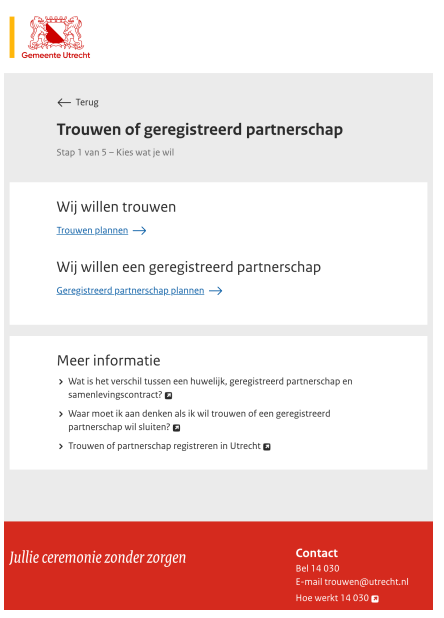

**Keuze verbintenis**:
- ik wil trouwen
- ik wil een geregistreerd partnerschap
- ik wil een omzetting ← RLI de backend ondersteunt dit nu wel

**POST API**:

**Deze gegevens worden opgestuurd**:
- identifier voor keuze tussen trouwen of geregistreerd partnerschap
- Er zijn afspraken nodig over de identifier van het type.

> Op dit moment is het type huwelijk voor de backend een enum waarbij de mogenlijke waarde zijn "huwelijk","partnerschap","omzetting"
> 
> **Vragen**
> - Is het type van het huwelijk achteraf nog aan te passen?

```json  
PUT {environment}/api/huwelijken/{id}

{
  "type":"{het gekozen type geïdentificeerd als enum}"
}

RESPONSE

{
  ... het volledige huwelijksobject.
}
```

**Acceptatiecriteria Backend**
- [ ] Het type van het huwelijk kan worden omgezet zonder in te loggen (`hoe gaan we valideren dat je wel de eigenaar bent? lopende sessie?`)


### Scherm 2: datum kiezen

[Bekijk prototype ](https://huwelijk.utrecht.eend.nl/docs/site/huwelijksplanner/02b-trouwen-plannen-april.html)

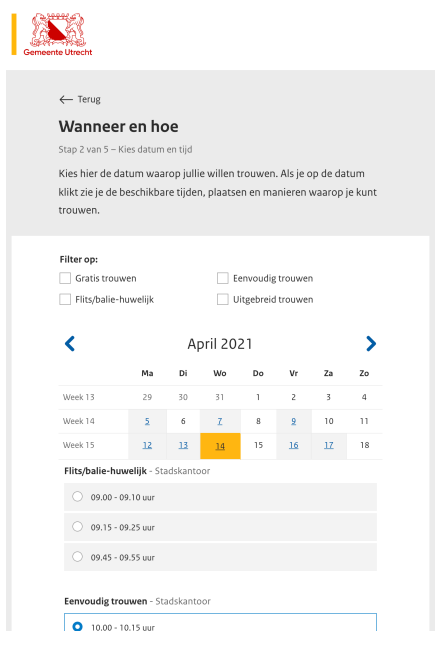

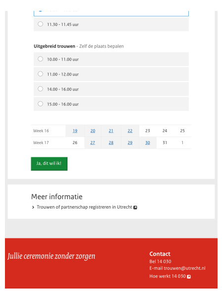

**Rekening houden met**:
- Datum moet zijn nadat beide personen meerderjarig (18 of ouder) zijn (persoonsgegevens zijn echter nog niet beschikbaar in deze stap)
- Datum alleen op beschikbare datums.
- Datum moet zijn na vandaag.
- Datum is maximaal uiterste datum X in toekomst.

**GET API**:
- Deze gegevens zijn nodig om de pagina te tonen.
- Request parameters:
- Gemeente (verplicht of afwezig. De default Utrecht?)
- Type (optioneel, anders alle types)
- begindatum (optioneel, anders vanaf vandaag + minimumtijd - nu 14 dagen)
- einddatum (optioneel, anders uiterste datum in toekomst - nu maximaal 1 jaar in de toekomst)


**Response**:
lijst met unieke combinaties van datum + tijdstip + type
extra velden: locatie
Afspraken over identifiers:
gemeente
type
"geregistreerd partnerschap" - "flitshuwelijk" - "gratis huwelijk" - "eenvoudig
huwelijk" - "uitgebreid huwelijk"

> **Vragen**
> - Is het interval nu altijd hetzelfde? In het verleden verschilde het naargelang product
> 
> Deze API is een beetje complex, dus wat pointers ter verduidelijking
> - Starttijd is een datetime
> - Stoptijd is een datetime
> - Interval is een PHP-interval value en bepaald de grootte van de blokjes die terug worden gegeven
> - Blokjes worden altijd teruggegeven (ook als er geen resources beschikbbaar zijn binnen dat blokje)
> - Ook ceremonies (gratis, flits etc.) zijn resources
> - Het kan dus zijn dat een locatie (e.g. trouwzaal) wel beschikbaar is terwijl het niet mogelijk is om binnen in dat blokje een ceremonie te plannen
> - Op het moment dat een resource ook maar een seconde geboekt is binnen het blokje, is die niet meer beschikbaar en komt die dus niet terug
> - Naast de beschikbaarheid van locaties kan deze functionaliteit ook worden gebruikt voor de beschikbaarheid van trouwambtenaren (casus ik wil een bepaald trouwambtenaar en locatie combinatie welke dagen kan ik dan kiezen)
> 
> HET IS AANBEVOLEN OM DEZE FUNCTIONALITEIT NIET TE GEBRUIKEN VOOR TROUWAMBTENAREN ZONDER DAT ER IS INGELOGD (anders lek je beschikbaarheid)

```json  
GET {environment}/api/calendar/availiablitycheck?start={datetime}&stop={datetime}&interval=1h&resources_could[]=resource1Uri,&resources_could[]=resource2Uri,&resources_could[]=resource3Uri

{
}

RESPONSE

{
  "2022-09-01": [
    {
      "start":"2022-09-01:09:00:00",
      "stop":"2022-09-01:10:00:00",
      "resources":[
          "resource1Uri",
          "resource2Uri",
          "resource3Uri",
      ]
    },
    {
      "start":"2022-09-01:10:00:00",
      "stop":"2022-09-01:11:00:00",
      "resources":[
          "resource1Uri",
          "resource3Uri",
      ]
    }
  ],  
  "2022-09-02": [
    {
      "start":"2022-09-01:09:00:00",
      "stop":"2022-09-01:10:00:00",
      "resources":[
          "resource1Uri",
          "resource2Uri",
          "resource3Uri",
      ]
    },
    {
      "start":"2022-09-01:10:00:00",
      "stop":"2022-09-01:11:00:00",
      "resources":[]
    }
  ],  
}
```

> Voordat er te zien is welke locaties voor welke producten beschikbaar zijn moeten beide eerst worden opgehaald. 

Dit gaat door PDC (producten-diensten combinaties). Ceremonies, locaties en eventueel trouwambtenaren zijn producten die een gemeente aanbiedt binnen een bepaalde context (catalogus). Hierbij wordt de context gevormd door het wettelijk kader. Simpel gezegd, er zijn dus  "partnerschap", "huwelijks" en "omzetting" catalogi. Hierbinnen zijn producten van het type "ceremonie", "locatie" en "ambtenaar". Waarbinnen de ceremonie leidend is voor de opties met betrekking tot "locaties" en "ambtenaar" Producten kunnen tot meerdere catalogi horen.
> 
> In de praktijk betekent dit dat er een aantal stappen nodig zijn voor het vormen van een dataset. 
> 1. Ophalen van de ceremonies die mogelijk zijn bij een bepaald huwelijkstype
> 4. Ophalen van de ceremonies voor dat huwelijkstype
> 2. Ophalen van de locaties voor dat ceremonietype
> 3. Ophalen van de ambtenaren voor dat ceremonietype
> 4. Ophalen van de extra producten voor dat ceremonietype
> 
> Dat is omslachtig, alternatief is om de bovenstaande dataset in één keer op te halen aan de hand van de 'extend' functionaliteit.
> `GET {environment}/api/sdg/v1/producten?catalogus=huwelijk&extend[]=gerelateerdeProducten` Dit levert dan de vier ingeregelde ceremonietypen op die ieder in hun gerelateerdeProducten array de mogelijke locaties, ambtenaren en extra producten bevatten.
> 
> Ieder product bevat in zijn root een URL-property. Dat is de resource identifier voor de calendar API. Let op! Ceremonies, Locaties en Ambtenaren kennen altijd een beschikbaarheid. Extra producten kunnen een beschikbaarheid hebben (bijvoorbeeld geen duiven loslaten op zondag). Maar het kan ook zijn dat ze niet in de calendar voorkomen.

```json  
GET {environment}/sdg/api/v1/producten?catalogus=huwelijk&extend[]=gerelateerdeProducte

{
}

RESPONSE

{
  "results":[
    {
    "url": "http://pdc.data.ergens.nl/sdg/api/v1/producten/e94d35b7-2903-4593-8dad-f91753157f54",
	"uuid": "e94d35b7-2903-4593-8dad-f91753157f54",
	"upnLabel": "flits/balie huwelijk",
	"upnUri": "http://standaarden.overheid.nl/owms/terms/",
	"versie": 1,
	"publicatieDatum": "2021-03-24T17:23:02",
	"productAanwezig": false,
	"productValtOnder": {},
	"verantwoordelijkeOrganisatie": {
		"url": "",
		"owmsIdentifier": "http://standaarden.overheid.nl/owms/terms/Utrecht_(gemeente)",
		"owmsPrefLabel": "Utrecht",
		"owmsEndDate": null
	},
	"bevoegdeOrganisatie": {
		"naam": "Deventer",
		"owmsIdentifier": "http://standaarden.overheid.nl/owms/terms/Utrecht_(gemeente)",
		"owmsPrefLabel": "Utrecht",
		"owmsEndDate": null
	},
	"catalogus": "huwelijk",
	"locaties": [],
	"doelgroep": "burger",
	"vertalingen": [
		{
			"taal": "nl",
			"productTitelDecentraal": "flits/balie huwelijk",
			"specifiekeTekst": " snel aan de balie trouwen",
			"procedureBeschrijving": "U doet online melding en dan gaan we u trouwen",
			"kostenEnBetaalmethoden": "500,- online of contant aan de ballie",
			"uitersteTermijn": "",
			"conditions": "Een flitshuwelijk moet 14 dagen voor voltrekking worden gemeldt bij de Gemeente",
			"notice": "",
			"decentraleProcedureLink": "",
			"vereisten": "",
			"bewijs": "",
			"contact": "",
			"verwijzingLinks": [ ],
			"synonyms": [
				{
					"synonym": "spoedhuwelijk"
				},
			],
			"wtdBijGeenReactie": "",
			"datumWijziging": "2021-03-24T17:24:16",
			"productAanwezigToelichting": "",
			"productValtOnderToelichting": ""
		}
	],
	"gerelateerdeProducten": [
      {
      "url": "http://pdc.data.ergens.nl/sdg/api/v1/producten/e94d35b7-2903-4593-8dad-f91753157f54",
      "uuid": "e94d35b7-2903-4593-8dad-f91753157f54",
      "upnLabel": "Balie",
      "upnUri": "http://standaarden.overheid.nl/owms/terms/",
      "versie": 1,
      "publicatieDatum": "2021-03-24T17:23:02",
      "productAanwezig": false,
      "productValtOnder": {},
      "verantwoordelijkeOrganisatie": {
          "url": "",
          "owmsIdentifier": "http://standaarden.overheid.nl/owms/terms/Utrecht_(gemeente)",
          "owmsPrefLabel": "Utrecht",
          "owmsEndDate": null
      },
      "bevoegdeOrganisatie": {
          "naam": "Deventer",
          "owmsIdentifier": "http://standaarden.overheid.nl/owms/terms/Utrecht_(gemeente)",
          "owmsPrefLabel": "Utrecht",
          "owmsEndDate": null
      },
      "catalogus": "locaties",
      "locaties": [],
      "doelgroep": "burger",
      "vertalingen": [
          {
              "taal": "nl",
              "productTitelDecentraal": "balie",
              "specifiekeTekst": "Trouwt aan de balie van de burgelijke stand",
              "procedureBeschrijving": "Bij binnenkomst melden",
              "kostenEnBetaalmethoden": "Geen extra kosten",
              "uitersteTermijn": "",
              "conditions": "",
              "notice": "",
              "decentraleProcedureLink": "",
              "vereisten": "",
              "bewijs": "",
              "contact": "",
              "verwijzingLinks": [ ],
              "synonyms": [
                  {
                      "synonym": "spoedhuwelijk"
                  },
              ],
              "wtdBijGeenReactie": "",
              "datumWijziging": "2021-03-24T17:24:16",
              "productAanwezigToelichting": "",
              "productValtOnderToelichting": ""
          }
      ],
      "gerelateerdeProducten": []
    },
    ... etc voor ambtenaren en extra's
	 
	 ]
  },
  ...
}
```
**POST API**
Deze gegevens worden vanaf deze stap naar de server verstuurd.
- datum
- tijdstip
- type

> De backend dwingt geen geldige invoer af. Er zouden namelijk nog correcties kunnen plaatsvinden en niet alle validaties kunnen worden uitgevoerd op een onvolledige dataset. I.p.v. daarvan houdt de backend een checklist array bij waarin de resultaten van de verschillende controles tijdens het proces worden gevonden.
> 
> Voor de backend is datum en tijdstip een veld
> 
> Voor de backend zijn type en ceremonie andere dingen. Het een gaat over wat je juridisch wilt (huwelijk, omzetten, partneschap) ofwel het wettenlijk kader. Het andere gaat over de beleving (flitshuwelijk, gratis huwelijk, eenvoudig huwelijk, uitgebreid huwelijk) die de gemeente aanbiedt. Het wettelijk kader staat vast en is niet configureerbaar. De producten waarmee invulling wordt gegeven aan het wettelijk kader zijn per gemeente verschillend en wel configureerbaar. Deze worden onttrokken uit het PDC. 

```json  
PUT {environment}/api/huwelijk/{id}

{
  "moment":"{datetime voor eht start moment van het huwelijk",
  "ceremonie":"{uuid of uri van gekozen het gekozen product voor cermonie"
}

RESPONSE

{
  ... het volledige huwelijks object.
}
```

**Acceptatiecriteria Backend**
- [ ] Moment en ceremonie kunnen worden geset
- [ ] De backend controleert of het moment minimaal 2 weken in de toekomst ligt (en noteert het resultaat in de checklist)
- [ ] De backend controleert of de gekozen cermonie op het gekozen moment en tijdstip beschikbaar is (en noteert het resultaat in de checklist)
- [ ] De backend bevat voorbeelddata voor locaties, ambtenaren en extra producten bij de cermonies gratis, flist/balie huwelijk, eenvoudig en uitgebreid trouwen
- [ ] Bij het selecteren van producten die kosten met zich mee brengen wordt de property kosten herberekend

### Scherm 3: overzicht keuze, door naar DigiD

[Bekijk prototype ](https://huwelijk.utrecht.eend.nl/docs/site/huwelijksplanner/03-inloggen-digid.html)

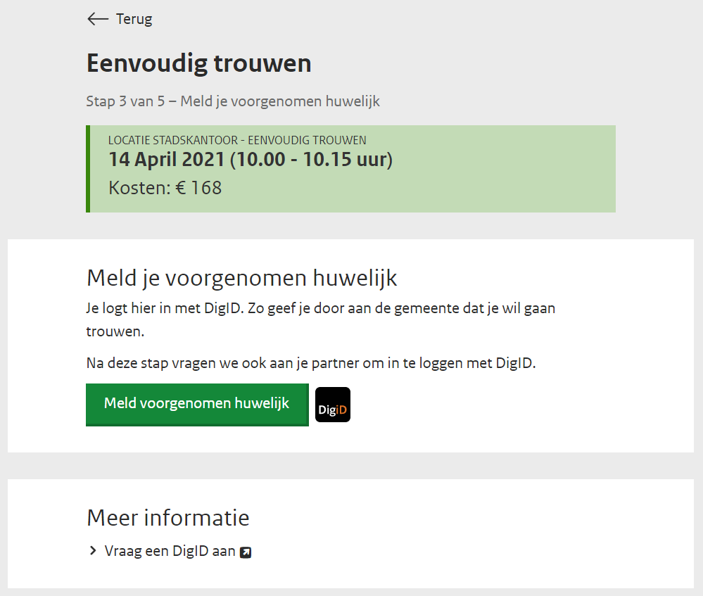

**Overzicht**:
- keuze product
- datum en tijdstip
- Betaal om melding te maken van voorgenomen huwelijk, tijd en locatie te reserveren.

**Opmerking**:
op dit punt kun je al een QR-code tonen zodat de partner ook kan inloggen, zodat je het echt "tegelijk en samen doet"

**GET API**:
Deze informatie is nodig om de pagina te tonen:
- gekozen type
- product prijs
- locatie
- gekozen tijdstip

> moment, kosten en type zitten standaard in het huwelijksobject. Voor cermonie, ambtenaar en locatie wordt in principe alleen de verwijzing getoond. De volledige objecten kunnen echter het bericht tonen met de extend functionaliteit.

```json  
GET {environment}/api/huwelijk/{id}?extend[]=ambentaar&xtend[]=locatie&xtend[]=cermonie

{
}

RESPONSE

{
  ... het volledige huwelijksobject inc type, cermonie, ambtenaar en locatie.
}
```

**POST API**:

Een POST naar een URL met de intentie om te redirecten naar DigiD. Gegevens die de server moet weten: naar welke URLs geredirect moet worden wanneer DigiD een success is de URL van de foutmelding pagina

> De gebruiker kan worden geforward naar `GET {environment}/user/inloggen/digid`. Forward en error URL zijn onderdeel van de configuratie en worden vanuit veiligheidsoogpunt niet live uitgewisseld. Na inloggen wordt de gebruiker doorgezet naar de forward URL met een `token`query parameter met daarin een token. Dit token kan worden gebruikt om via `GET {environment}/user/inloggen/claim/token` eenmalig een JWT-token op te halen. Dit JWT-token dient vervolgens in de `Authorisation` header te worden meegegeven in opvolgende calls om de gebruiker te identificeren. 

**Unhappy flow**
- DigiD is down.


**Acceptatiecriteria Backend**
- Er kan worden doorverwezen naar DigiD


### Scherm: inloggen met DigiD

[Bekijk prototype ](https://huwelijk.utrecht.eend.nl/docs/site/huwelijksplanner/03-inloggen-digid.html)

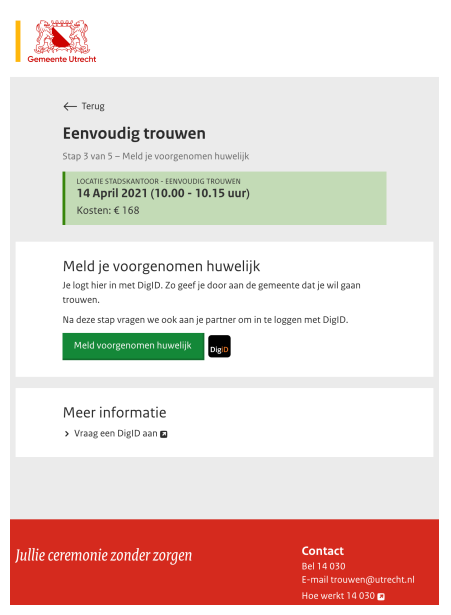

### Scherm: inloggen bij DigiD

[Bekijk prototype ](https://huwelijk.utrecht.eend.nl/docs/site/huwelijksplanner/03b-inloggen-digid.html)

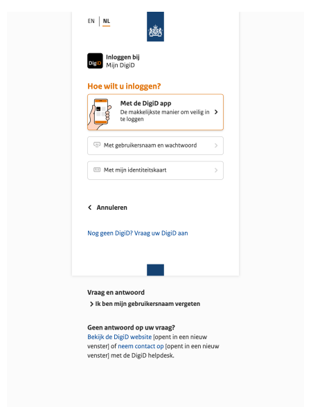>

> Zie [Scherm 3: overzicht keuze, door naar DigiD]() 


**Acceptatiecriteria Backend**
- Er kan worden ingelogd met digispoof


### Scherm 4: contactgegevens invullen en gegevens controleren
[Bekijk prototype ](https://huwelijk.utrecht.eend.nl/docs/site/huwelijksplanner/04-melding-voorgenomen-huwelijk-anne.html)

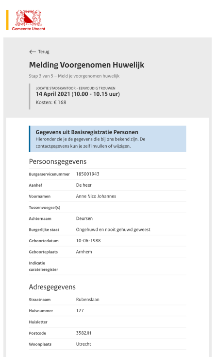
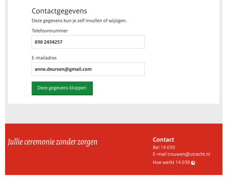

**Deze pagina toont ter controle**:
- Overzicht persoonsgegevens
- Overzicht adresgegevens:
- Geeft de mogelijkheid voor persoon 1 voor het aanvullen van contactgegevens:
- telefoonnummer (optioneel, voor bijvoorbeeld slechthorende)
- e-mailadres

**GET API**:
De volgende gegevens zijn nodig om de pagina te tonen:
- Persoonsgegevens
- Burgerservicenummer
- Aanhef
- Voornamen
- Tussenvoegsel(s)
- Achternaam
- Burgelijke staat
- Geboortedatum
- Geboorteplaats
- Indicatie curateleregister
- Adresgegevens
- Straatnaam
- Huisnummer (+ toevoegingen)
- Postcode
- Woonplaats

**POST API**:
Deze pagina verstuurt het volgende naar de server:
telefoonnummer - optioneel
e-mailadres - verplicht

> Voordat de persoonsgegevens van een partner inzichtelijk zijn moeten deze eerst worden gekoppeld huwelijk. Het koppelen van iedereen die (juridisch) moet instemmen gebeurt via een assent object.

```json  
PUT {environment}/api/huwelijk/{id}

{
  "partners":[
    {
      "name":"Partner bij huwelijk",
      "description":"U wordt uitgenodigd als partner bij een huwlijk",
      "resource":"{uri van het huwelijk]",
      "forwardUrl":"",
      "property":"partners",
      "process":"{url die gebruikt kan worden om de assent te accepteren}",
      "klant":"{uri of geheel klantobject}",
      "status":"",
      "requester":"{bsn van ingelogde gebruiker}"
    }
  ]
}

RESPONCE

{
  ... het volledige huwelijks object, inclusief assents
}
```

> Nadat de assent is toegekend kunnen de BRP-gegevens van degene die heeft ingestemd via de assent worden opgehaald door de extend functionaliteit.

**Acceptatiecriteria Backend**
- [ ] Als het BSN nummer van de aanvrager en de klant gelijk is, wordt de accent automatisch op `granted` gezet.
- [ ] In andere gevalen word de status op `requested` gezet


### Scherm 5: partner uitnodigen

[Bekijk prototype ](https://huwelijk.utrecht.eend.nl/docs/site/huwelijksplanner/05-vraag-sanne.html)

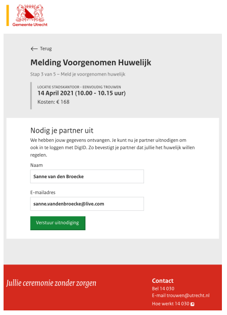

**Opmerkingen**:

Kan misschien met een QR-code i.p.v. een link per e-mail. Dit zou betekenen dat er minder latency op kan treden, geen junk- en/of mailverkeerrisico's meebrengen zoals persoonsgegevens van partner komend uit DigiD, i.p.v. zelf ingevuld

> Het uitnodigen van een partner gaat door het indienen van een assent verzoek

```json  
PUT {environment}/api/huwelijk/{id}

{
  "partners":[
    {
      "name":"Partner bij huwelijk",
      "description":"U wordt uitgenodigd als partner bij een huwlijk",
      "resource":"{uri van het huwelijk]",
      "forwardUrl":"",
      "property":"partners",
      "process":"{url die gebruikt kan worden om de assent te accepteren}",
      "klant":"{uri of geheel klantobject}"
    }
  ]
}

RESPONSE

{
  ... het volledige huwelijksobject, inclusief assents
}
```

**Acceptatie critteria Backend**
- [ ] Bij het aanmaken van de assent wordt er een email/sms verstuurd naar de toesteminggevenden (afhankelijk van of email en telefoonnummer bekend zijn)
- [ ] Als zowel email als telefoonnummer niet bekend zijn wordt er een foutmelding gegenereerd
- [ ] Er wordt een assent secret gegenereerd

> Na het aanmaken van het assent verzoek wordt er een assent id en secret teruggegeven. Deze kunnen worden gebruikt om de assent later op te halen. De frontend kan een link genereren die met een QR-code, WhatsApp of ander kanaal kan worden verstuurd, die een ander persoon in staat stelt om in te loggen en die assent te accepteren. Let op! Assent kunnen alleen van status worden verwisseld door gebruikers die zijn ingelogd met DigiD en waarvan het BSN nummer van de gebruiker overeenkomt met het BSN nummer van de assent.

### Scherm: getuigen aanmelden

[Bekijk prototype ](https://huwelijk.utrecht.eend.nl/docs/site/huwelijksplanner/07b-getuigen-extra.html)

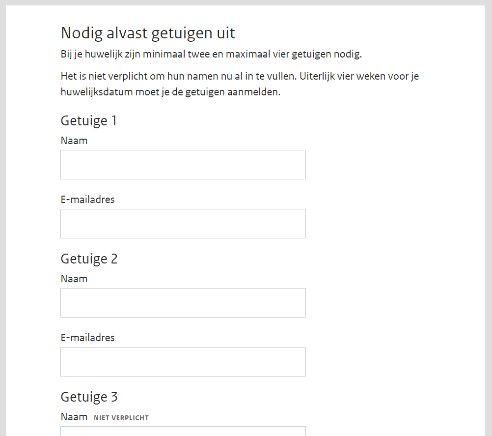

> Het toevoegen van getuigen gaat via het aanvragen van een assent voor die getuigen. Het enige verschil is hierbij dat getuigen bestaan uit een array van partner (geïdentificeerd aan de URI van hun assent).

```json  
PUT {environment}/api/huwelijk/{id}

{
  "getuigen":{
    "{uri partner 1}":[
      {
        "name":"Getuige bij huwelijk",
        "description":"U wordt uitgenodigd als getuige bij een huwelijk",
        "resource":"{uri van het huwelijk]",
        "forwardUrl":"",
        "property":"partners",
        "process":"{url die gebruikt kan worden om de assent te accepteren}",
        "klant":"{uri of geheel klantobject}"
      }
    ],    
    "{uri partner 2}":[
      {
        "name":"Getuige bij huwelijk",
        "description":"U wordt uitgenodigd als getuige bij een huwelijk",
        "resource":"{uri van het huwelijk]",
        "forwardUrl":"",
        "property":"partners",
        "process":"{url die gebruikt kan worden om de assent te accepteren}",
        "klant":"{uri of geheel klantobject}"
      }
    ],    
  }
}

RESPONSE

{
  ... het volledige huwelijksobject, inclusief assents
}
```

**Acceptatiecriteria Backend**
- [ ] In het array mogen alleen keys voorkomen die ook als assent onder partners bestaan (anders volgt een foutmelding)
- [ ] Een partnerarray mag niet meer dan twee getuigen bevatten (anders volgt een foutmelding)

### Scherm: controles uitgevoerd

[Bekijk prototype ](https://huwelijk.utrecht.eend.nl/docs/site/huwelijksplanner/08-check05.html)

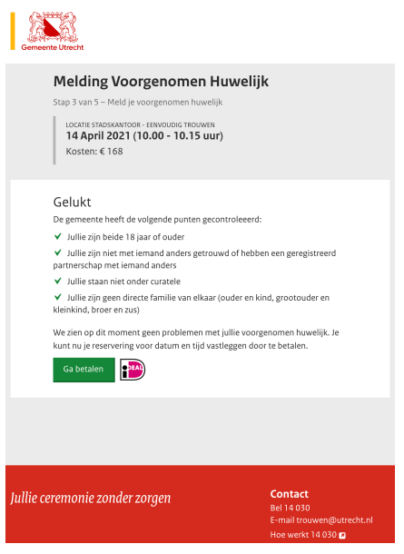

**Happy flow**: 
- alle controles zijn geslaagd

**Unhappy flow**
- één of meerdere checks zijn niet geslaagd

**GET API**:
Deze gegevens zijn nodig om de pagina te tonen:
- lijst van checks
- beschrijving controle
- geslaagd / niet geslaagd

**POST API**

Deze pagina verstuurt zelf geen informatie, maar de server moet wel weten naar
welke URLs geredirect moet worden na een succesvolle of mislukte betaling.

> De huwelijks service voert zelf continu checks uit aan de hand van de voorliggende data en slaat de resultaten daarvan op in het checklistarray. Deze checklist is continu beschikbaar binnen het huwelijksobject

```json  
GET {environment}/api/huwelijk/{id}

{
}

RESPONSE

{
  ... het volledige huwelijks object waaronder de checklist
}
```

**Acceptatiecriteria Backend**
- [ ] De checklist wordt correct bijgehouden en uitgevoerd op het moment dat het huwelijksobject wordt bijgewerkt (zie API documentatie voor details)

### Scherm: wachten op partner

[Bekijk prototype ](https://huwelijk.utrecht.eend.nl/docs/site/huwelijksplanner/06-wacht-op-sanne.html)

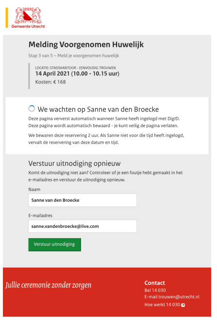

**Unhappy flow**
- Reservering verlopen.

**GET API**
- naam partner
- e-mailadres partner
- tijdstip verlopen reservering
- status reservering: verlopen / niet verlopen
- PUT API
- Gegevens om bestaande informatie aan te passen.
- naam partner
- e-mailadres partners


**Acceptatiecriteria Backend**
-

### Scherm: betaling gelukt

[Bekijk prototype ](https://huwelijk.utrecht.eend.nl/docs/site/huwelijksplanner/10-betaling-geslaagd.html)

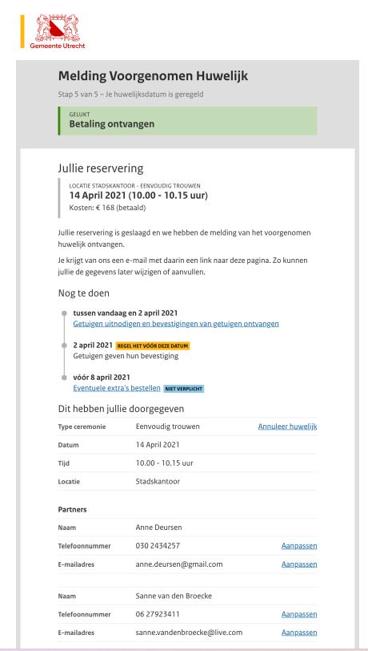

**GET API**

Voor feedback:
status betaling: gelukt / niet gelukt
Voor overzicht gegevens:

E-mail: bevestiging melding van huwelijk

Mail naar beide partners.
Benodigde gegevens voor e-mail template:
naam 1
naam 2
datum en tijdstip
locatie


type
laatste datum getuigen melden
laatste datum extra's bestellen
URL om reservering te bekijken

### Scherm: getuigen aanpassen

[Bekijk prototype ](https://huwelijk.utrecht.eend.nl/docs/site/huwelijksplanner/11-getuigen-wijzig.html)

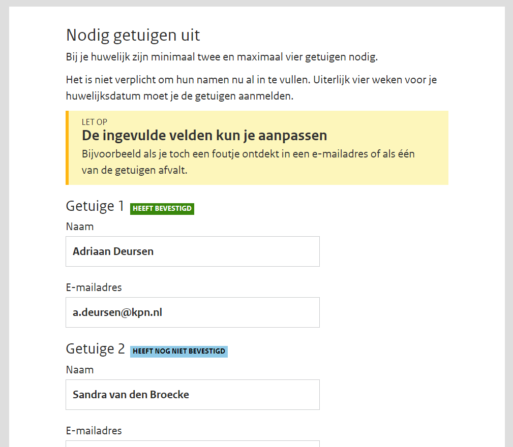

> Assents kunnen niet meer worden aangepast nadat deze zijn geaccepteerd of afgewezen.  Tot die tijd kunnen DE KLANTGEGEVENS email en telefoonnummer worden aangepast via `PUT {environment}/assent/api/v1/{id}`

**Acceptatiecriteria Backend**
- [ ] Email en telfoonnummer kunnen via een assent worden aangepast totdat deze uit de status requested is gekomen

### Scherm: extra bestellen

[Bekijk prototype ](https://huwelijk.utrecht.eend.nl/docs/site/huwelijksplanner/11b-extra.html)

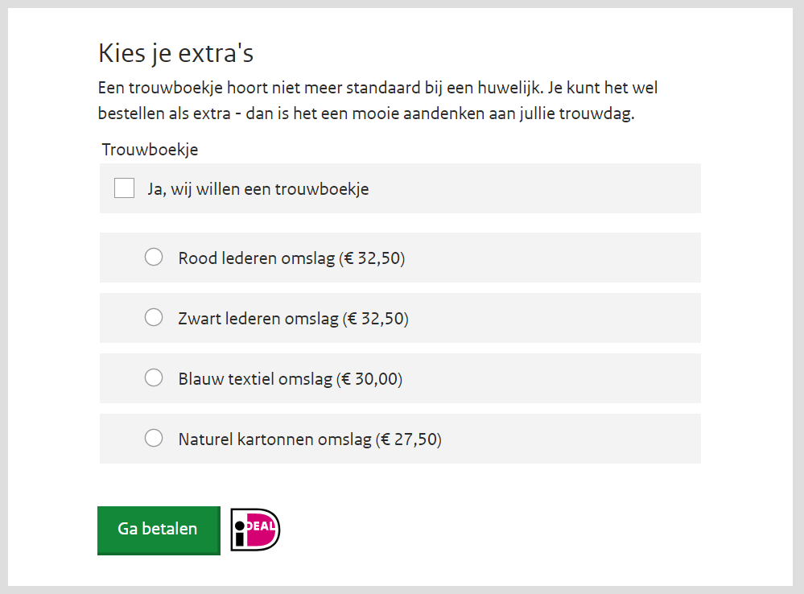!

Bijvoorbeeld, een huwelijksboekje bestellen en gelijk betalen.
Opmerking: is dit nog achteraf te wijzigen? Betaal je dan het bedrag voor het
nieuwe product, en wordt buiten de planner om het al betaalde bedrag
teruggestort? Of moet je dan kunnen bijbetalen? Dan moet de server ook weten
hoeveel al betaald is.

**GET API**:
Lijst extra producten, met varianten:
product naam (bijv. trouwboekje)

product ID
mogelijke varianten (rood leder / zwart leder / blauw textiel / naturel karton):
variant titel
variant prijs
variant ID

> Extra's zijn onderdeel van het PDC en kunnen via de eerder genoemde PDC-call worden opgehaald

**POST API**:
- één of meerdere product ID + mogelijk variant ID

**Unhappy flow**:
- Storing in betaalservice.

> Extra's toevoegen en het betalen van een huwelijk zijn andere acties. Die kunnen niet in dezelfde stap worden afgerond. Extra's toevoegen is een kwestie van PUT op het huwelijks object met de URI's van de gewenste extra's. Het is niet mogelijk een "extra" meerdere keren te bestellen.

```json  
PUT {environment}/api/huwelijk/{id}

{
  "producten":[
    "{uri van extra 1}",
    "{uri van extra 2}"
   ]
}

RESPONSE

{
  ... het volledige huwelijks object
}
```

> Voor het creëren van een betaallink geldt dat de status van een huwelijk naar 'reported' moet worden gezet. Als alle checks een go zijn wordt er een order en factuur gemaakt.

```json  
PUT {environment}/api/huwelijk/{id}

{
  "status":"reported"
}

RESPONSE

{
  ... het volledige huwelijksobject inclusief order met betaallink
}
```

**Acceptatiecriteria Backend**
- Na het toevoegen van extra's wordt de prijs van het huwelijk herberekend
- Een huwelijk kan alleen op de status reported worden gezet als alle checks go zijn
- Nadat een huwelijk de status reported heeft gekregen kan het huwelijk niet meer door de burger worden aangepast
- Nadat de betaallink in de order is gebruikt om te betalen, en de betaling is geregistreerd, wordt het huwelijk op confirmed gezet
- Nadat het huwelijk op confirmed wordt gezet wordt en een email + factuur verstuurd naar de partners

### Scherm: annuleer reservering

**Opmerking**: de knop "Annuleer reservering" is een beetje onfortuinlijk, omdat "Annuleer" ook vaak betekent "Ik wil dat schermpje niet, doe niets". Misschien duidelijker om "Annuleren" (secondary button) en "Geen huwelijk reserveren" (primary button) te doen, of iets dergelijks.

> De vraag is ook even wat annuleren doet qua businesslogica, voor nu gaan we uit van
> - Verwijderen boeking in de calendar voor locatie en trouwambtenaar
> - Mails versturen (zie Scherm: bevestiging annulering)
> - Status huwelijk omzetten naar geannuleerd
>
> **Overige vragen**
> - Zijn er er casussen waarin een annulering niet mag worden verwerkt? (los van reeds voltrokken huwelijken)
> - Wie mag dit doen? beide partners? Inititatiefnemer?
> - Hoe gaan we de financiële afdeling op de hoogte brengen?

```json  
PUT {environment}/api/huwelijk/{id}

{
  "status": "cancelled"
}

RESPONSE

{
  ... het volledige huwelijks object
}
```

**Acceptatiecriteria  Backend**
- [ ] Bij het proberen te setten van de status "cancelled" controleerd de backend of is voldaan aan voorwaarden en rechten
- [ ] Na het zetten van de status worden de genoemde mails verstuurd
- [ ] Na het zetten van de status worden genoemde agendareserveringen verwijderd

### Scherm: bevestiging annulering

[Bekijk prototype ](https://huwelijk.utrecht.eend.nl/docs/site/huwelijksplanner/12-huwelijk-geannuleerd.html)

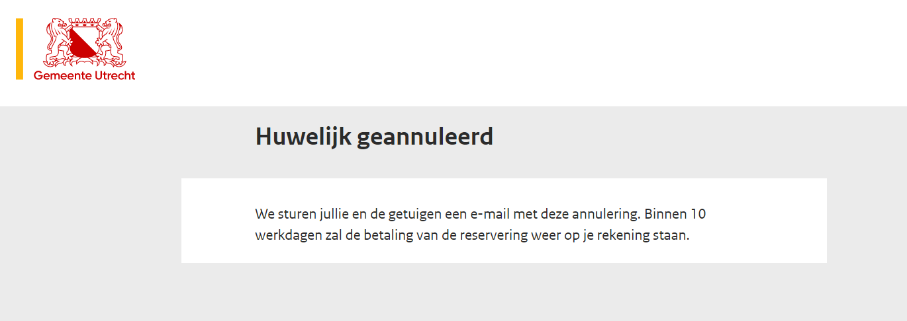

E-mail: bevestiging annulering

- e-mail aan partners
- andere e-mail aan getuigen
- andere e-mail aan trouwambtenaar <- Toevoeging RLI
- andere e-mail aan locatiemanager <- Toevoeging RLI
- andere e-mail aan afdeling burgerzaken <- Toevoeging RLI
- Details nader te bepalen.

> Wie levert de emailtemplates aan?

**Acceptatiecriteria Backend**
- [ ] Verstuurde mails voldoen aan gestelde templates

## Techniek

De pagina moet voldoen aan DigiD richtlijnen rondom een strikte Content-Security-Policy. We willen kiezen om een server-side rendering te doen met React, zodat we een nonce kunnen genereren voor elke pagina.


